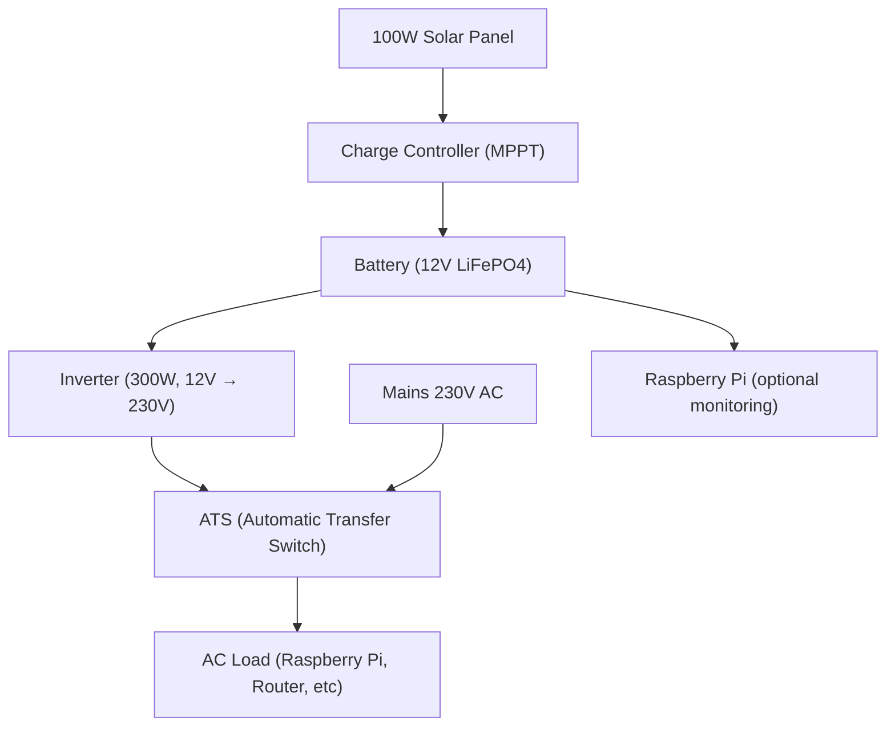
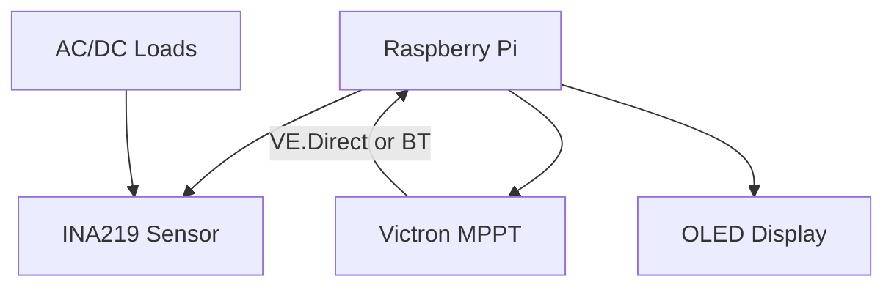

```mermaid
flowchart TD
    A["100W Solar Panel"] --> B["Charge Controller (MPPT)"]
    B --> C["Battery (12V LiFePO4)"]
    C --> D["Inverter (300W, 12V → 230V)"]
    D --> E["ATS (Automatic Transfer Switch)"]
    F["Mains 230V AC"] --> E
    E --> G["AC Load (Raspberry Pi, Router, etc)"]

    %% Optional monitoring
    C --> H["Raspberry Pi (optional monitoring)"]
```
## 

```mermaid
flowchart TD
    Pi[Raspberry Pi]
    INA[INA219 Sensor]
    Victron[Victron MPPT]
    OLED[OLED Display]
    LOADS[AC/DC Loads]

    Pi --> INA
    Pi --> Victron
    Pi --> OLED
    Victron -->|VE.Direct or BT| Pi
    LOADS --> INA
```